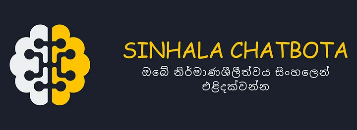
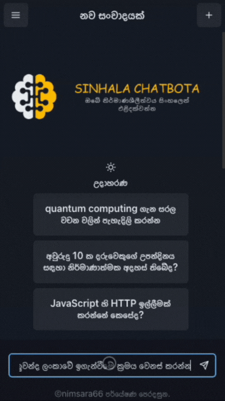
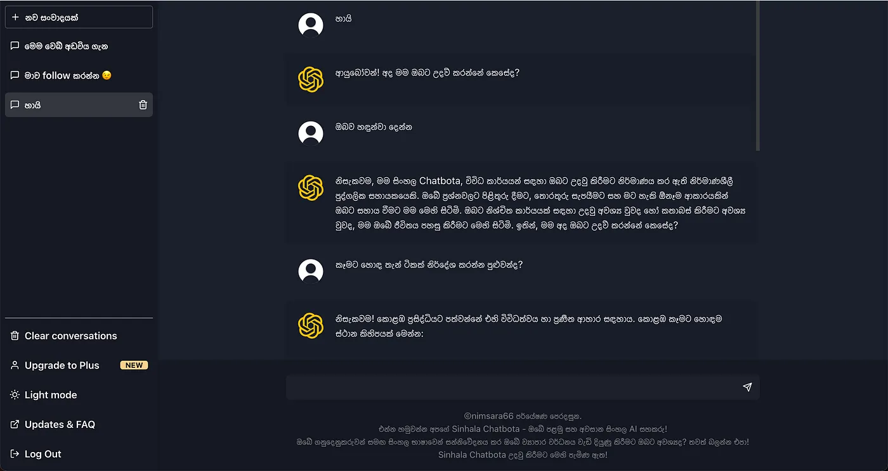
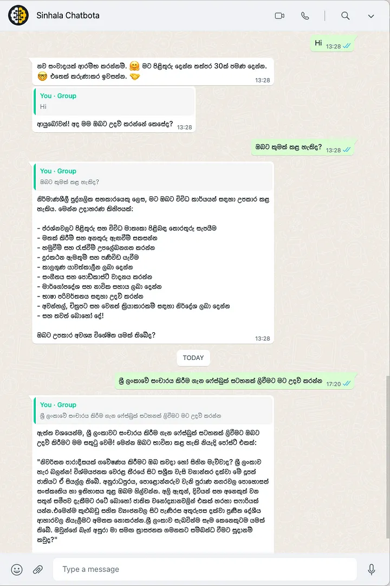
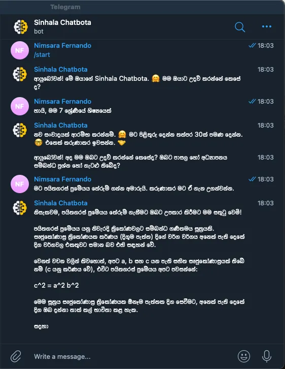

# Sinhala Chatbota



## Introduction

Welcome to Sinhala Chatbota, a revolutionary chatbot powered by the OpenAI Chat Competition API. This chatbot is designed to enhance customer experiences and improve productivity for businesses, especially those operating in Sri Lanka.



## Motivation

In today’s fast-paced world, businesses are leveraging artificial intelligence (AI) to engage with customers more meaningfully. Sinhala Chatbota addresses this need, offering unique features and capabilities.

## Key Features

### 1. Sinhala Language Support

Sinhala Chatbota excels in understanding and responding in Sinhala, catering to businesses in Sri Lanka where Sinhala is an official language.

### 2. Custom Memory

Customize the chatbot’s memory to store specific information, tailoring its responses to suit various business use cases.

### 3. Easy-to-Use WebUI

The user-friendly WebUI simplifies interactions, allowing users to access information quickly with varying levels of technical expertise.



### 4. WhatsApp and Telegram Integrations

Seamlessly communicate with customers using popular messaging apps like WhatsApp and Telegram. Sinhala Chatbota also supports message streaming for the WebUI and Telegram.


<br>


### 5. Custom Persona

Personalize the chatbot’s persona to align with your brand or specific use case, creating a more engaging and personalized experience.

### 6. Reliability

Customizable rate limiting and exploitation concerns are implemented to ensure responsible and efficient use, helping businesses manage costs effectively.

## Exciting Features Coming Soon

Sinhala Chatbota is evolving with upcoming features, including Messenger integration, vision support for image recognition, and voice support for a more immersive experience.

## Real-World Use Cases

Sinhala Chatbota’s versatility opens up possibilities across various industries, including AI study assistants, AI customer care agents, AI creative writers, and predictive use cases.

## Getting Started

Clone the repository and follow these steps to get started:

```bash
git clone https://github.com/nimsara66/sinhala-chatbot.git
cd sinhala-chatbota
npm install
npm run start


## Getting ChatGPT auth
- [access token](https://chat.openai.com/api/auth/session)
- copy `_puid` from cookie

## Concerns
[x] limit no of messages in a thread --> max 10
[x] limit no characters in the last message --> max 500
